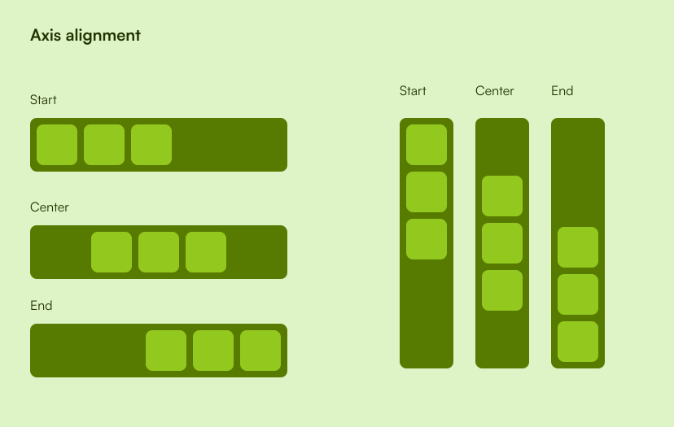

The layout tree is made up of `Layout` nodes.

The core concepts are [intrinsic size](https://en.wikipedia.org/wiki/Intrinsic_dimension)
and constraints. The intrinsic size is the preferred/requested size of a 
layout node, so for example a node could specify that it wants be as large as possible.

Constraints are the minimum and maximum width and height that a layout node can be,
it **will not** be any larger or smaller that these constraints.

The layout algorithm tries to satisfy each nodes intrinsic size, for example, if there
were three nodes that each wanted to fill the width of their parent, then each node
would be a 1/3 of the width.

Properties of layout nodes:
Not all layout nodes have all properties.

- Padding: The spacing between the edges of the node and it's content.
- Spacing: The spacing between child nodes.
- Main axis alignment: Specifies how to align child nodes on the main axis.
- Cross axis alignment: Specifies how to align child nodes on the cross axis.
- Constraints: The minimum and maximum size of a node.
- Intrinsic size: The preferred size of a node.

**Layout types:**

- `EmptyLayout`
- `BlockLayout`
- `HorizontalLayout`
- `VerticalLayout`

## Axes
Every layout node has two axes:

- Main axis: The axis along which content flows.
- Cross axis: The axis perpendicular to the main axis.

For most layouts the main axis is the x-axis and the cross axis is y-axis. The only 
exception currently is the 
[`VerticalLayout`](https://docs.rs/cascada/latest/cascada/vertical/struct.VerticalLayout.html)
whose main axis is the y-axis and cross axis is the x-axis.

### Vertical layout