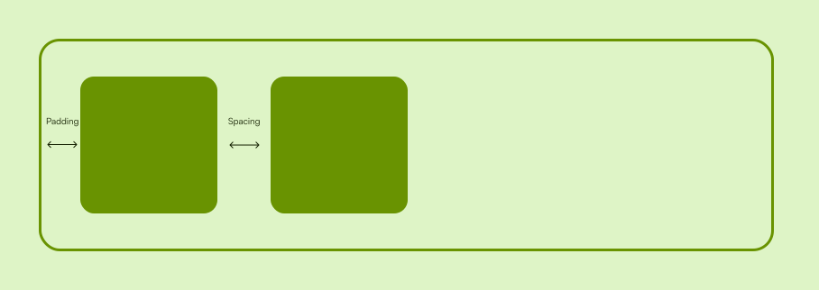

## Axes
Every layout node has two axes, the main axis and cross axis.

### Axis alignment

## Padding
Padding is the space between the edges of a node and it's content.

## Layout types

### Empty layout
### Block layout
### Horizontal layout

### Vertical layout