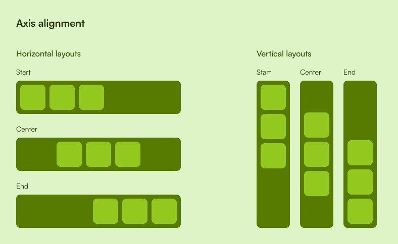

The layout tree is made up of `Layout` nodes.

## Axes
Every layout node has two axes:

- Main axis: The axis along which content flows.
- Cross axis: The axis perpendicular to the main axis.

For most layouts the main axis is the x-axis and the cross axis is y-axis. The only 
exception currently is the 
[`VerticalLayout`](https://docs.rs/cascada/latest/cascada/vertical/struct.VerticalLayout.html)
whose main axis is the y-axis and cross axis is the x-axis.

### Axis alignment

## Padding
Padding is the space between the edges of a node and it's content.

## Layout types

### Empty layout
### Block layout
### Horizontal layout

### Vertical layout